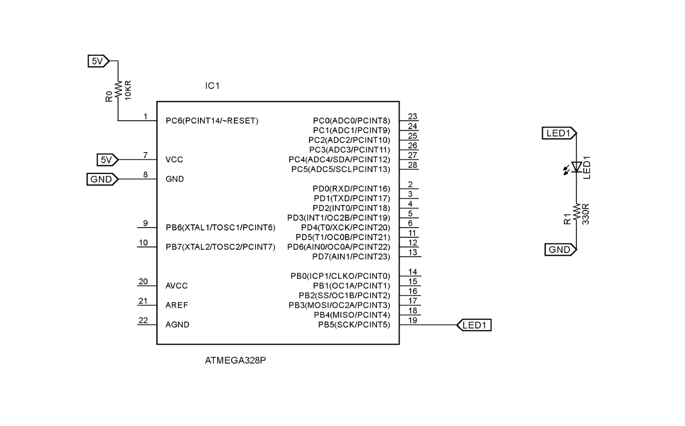
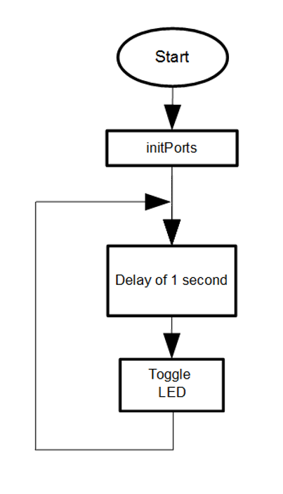
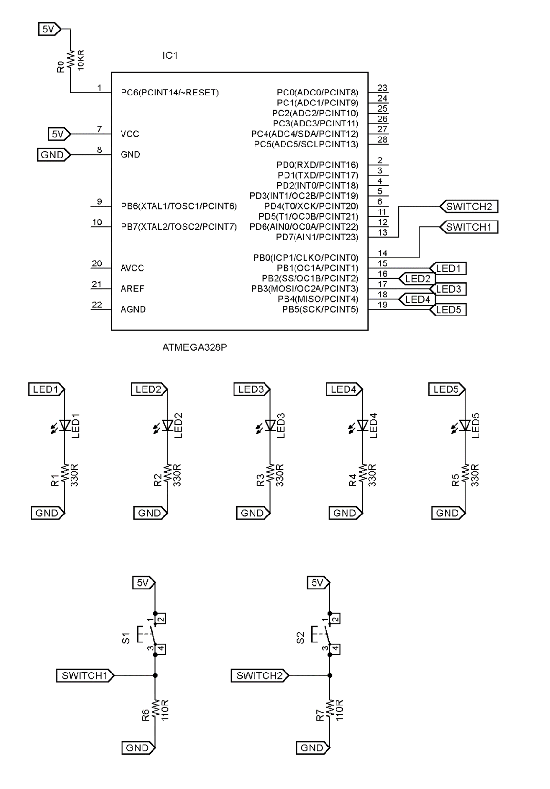
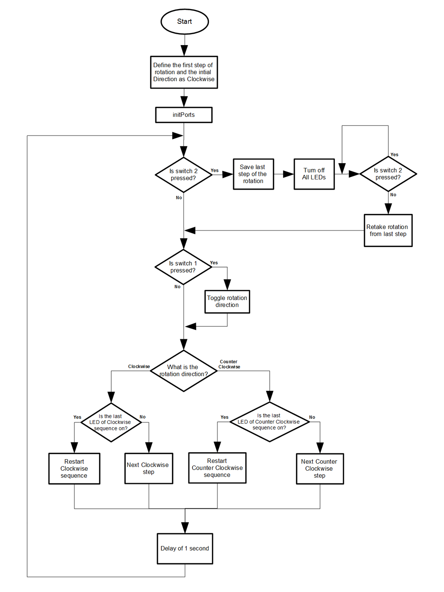
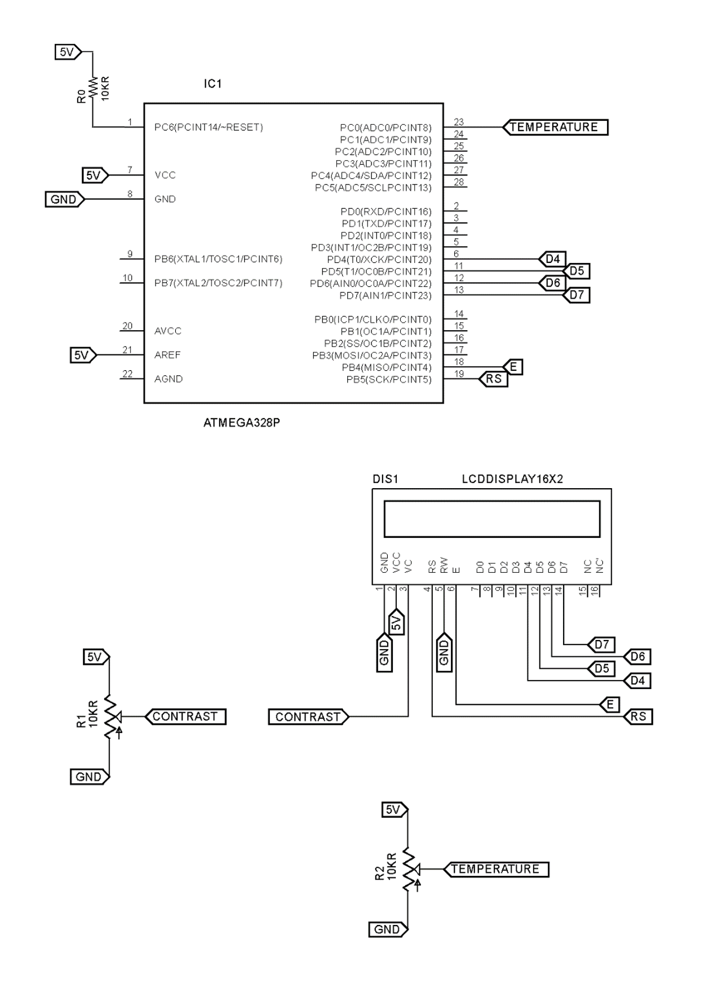
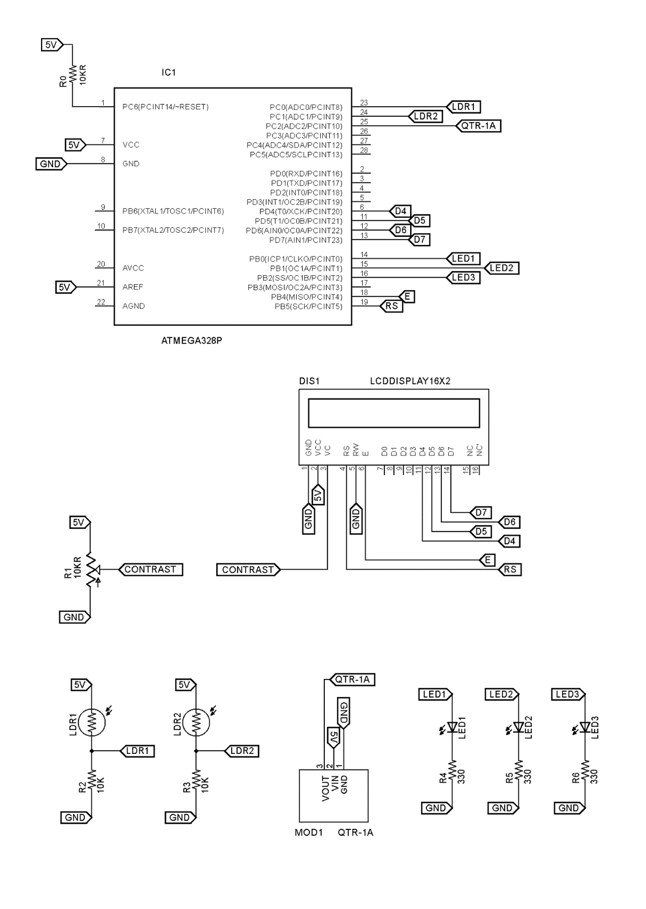
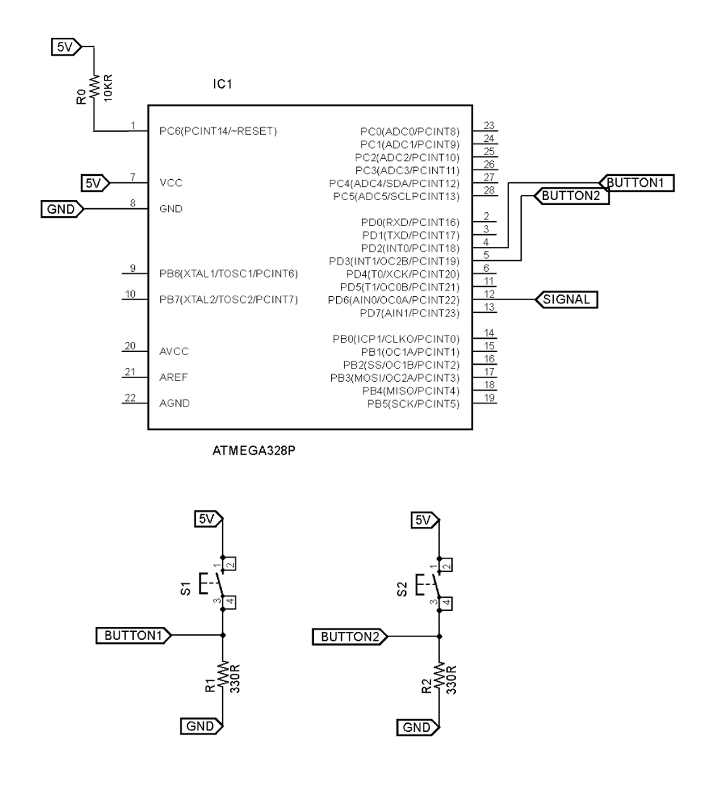
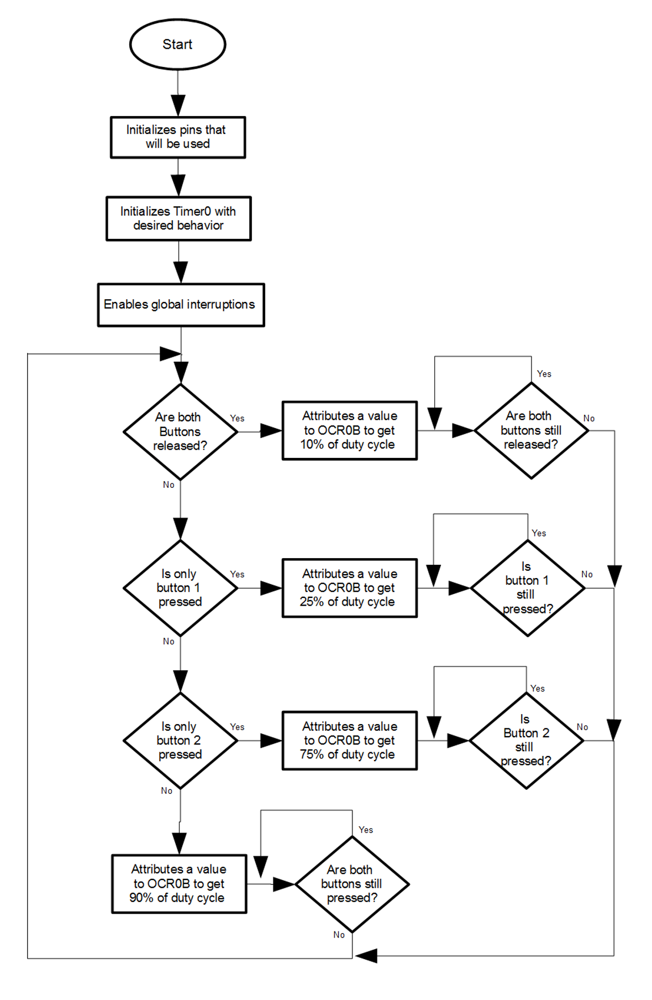
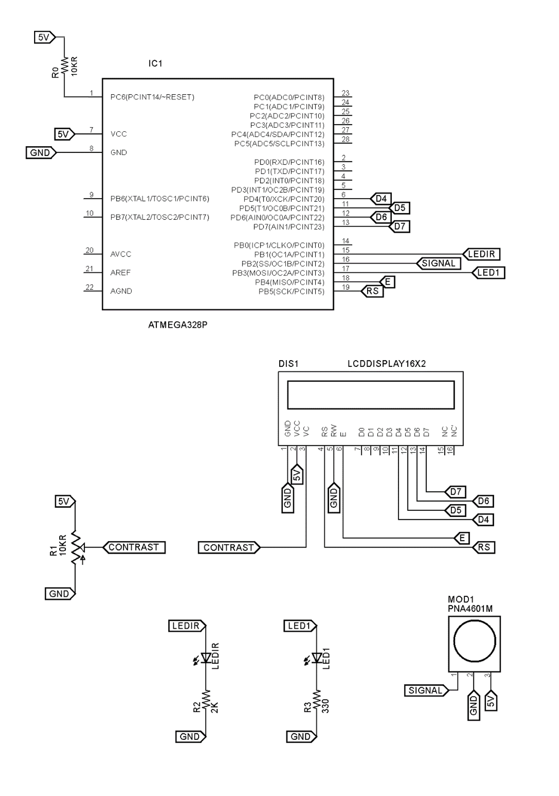
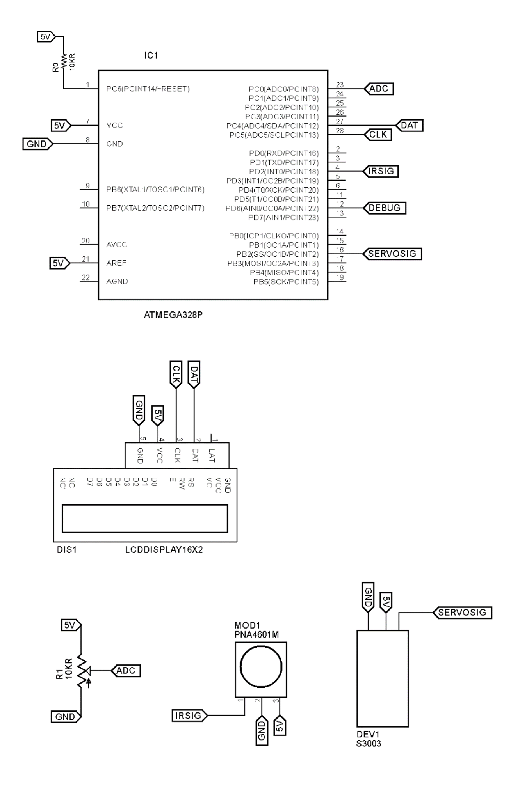

# MSOE | EE2920 Embedded Systems Labs

## About the Project

This repository brings up an introductory series of implementations on how to design Embedded Systems when dealing with registers level using C/C++ Programming language. The concepts covered in this series help you to understand the general working of modern microcontrollers, including many of their common peripherals.

The series presented here is a throwback of a course called EE2920 Embedded Systems, taken by me as international student back in the Fall of 2014 at Milwaukee School of Engineering (MSOE). For this course, the microcontroller used was the ATmega328P, famous to compose Arduino boards such as Arduino Uno and Arduino Nano. However the general concepts covered touch a lot of concepts that are common sense for lots of modern microcontrollers, so the knowledge obtained from this course can be easily used to better understand the internal architecture other devices and build firmware for them. 

## Table of Contents

The series requirements and content is shown in detail by the section for each lab. The following content topics present each lab's title to present to you a general idea of what it approached in this serie: 

* [Lab 01: simple Hello World](#lab-01-simple-hello-world)
* [Lab 02: GPIO interfacing LED's and Switches](#lab-02-gpio-interfacing-leds-and-switches)
* [Lab 03: GPIO in Switch Debouncing and HD44780 LCD Interfacing](#lab-03-gpio-in-switch-debouncing-and-hd44780-lcd-interfacing)
* [Lab 04: GPIO interfacing a QTR-8RC Sensor Array Module](#lab-04-gpio-interfacing-a-qtr-8rc-sensor-array-module)
* [Lab 05: Analog to Digital Conversion](#lab-05-analog-to-digital-conversion)
* [Lab 06: A/D Conversion, Interrupts and Analog Sensors](#lab-06-ad-conversion-interrupts-and-analog-sensors)
* [Lab 07: Waveform Generation](#lab-07-waveform-generation)
* [Lab 08: Infrared Object Sensing](#lab-08-infrared-object-sensing)
* [Lab 09: Servo Motor Control](#lab-09-servo-motor-control)

## Lab 01: simple Hello World

##### Requirements:

This lab is a simple "Hello World" routine sign if the ATmega328P and wiring power supply is working fine. That is made by setting up a blinking LED with an interval of 1 second between blinks.

##### Built with:

* ATmega328P (you can use Arduino Uno/Nano boards)
* 1x LED
* 1x 330Ω resistor

##### Schematic:

##### Flowchart:

## Lab 02: GPIO interfacing LED's and Switches

##### Requirements:

This lab makes use of the ATmega328P microcontroller's GPIO to interface five digital outputs (5 LEDs) and two digital inputs (2 switches/push-buttons). The idea is to use the buttons to control a row of LEDs arranged in an upside down "V" formation. In this formation, only one of the LEDs are on at the same time, with adjacent sequential transitions of LED's states every second. The first switch can be pressed to toggle the direction of these transitions, which can turn from clockwise to counter clockwise, or vice versa. The second switch keeps all LEDs off as long as it's being pressed. 

##### Built with:

* ATmega328P (you can use Arduino Uno/Nano boards)
* 5x LED's
* 5x 330Ω resistors

##### Schematic:

##### Flowchart:

## Lab 03: GPIO in Switch Debouncing and HD44780 LCD Interfacing

##### Requirements:

This lab it was introduced the use of alphanumeric LCD displays. The interface between the LCD display and the ATmega328p could be easily implemented by the use of a pre-defined structure and relatively high-level functions described in include files recommended to be used in this lab.

In the basic assignment, it is shown a simple system that was able to receive the signals of buttons (1 and 2) to get their states and activate events from them. Basically, the LCD display shows the state of button one, presenting ‘1’ to button pressed and ‘0’ to not pressed. At the same time, button two is used to blink a character in the display when it is held pressed. 

The purpose of the advanced assignment of this project is to make use of a LCD display to show a counter that can be incremented (if button one is pressed) or decremented (if button one is pressed while button two is held pressed). To make better use of these buttons, it was implemented a system that uses delays and loops to avoid the detection of bouncing from mechanical switches that are being used in this assignment, and also, prevent that multiple events were detected when buttons are pressed.

##### Built with:

* ATmega328P (you can use Arduino Uno/Nano boards)
* HD44780 LCD display
* 10KΩ potentiometer
* 2x push-buttons
* 2x 330Ω resistors

##### Schematic:

##### Flowchart:

## Lab 04: GPIO interfacing a QTR-8RC Sensor Array Module

##### Requirements:

This lab makes use of the ATmega328P microcontroller GPIO to interface the QTR-8RC module in order to detect incoming events from its reflectance sensors and measure the magnitude of reflection detected by them. The activity proposed also makes use of a LCD display to show the state of each one of the four used sensors, showing a sequence of four places on display relative to their states. The measuring is made by counting the time until the discharge of each sensor gets the threshold of the microcontroller used. If the system detects a higher reflectance, compared to a reference value, the time decreases and ‘1’ will be place in the position relative to the sensor used. On the other hand, if the level of reflectance gets lower, the time of discharge increases and gets higher than reference value, it will be shown ‘0’.

##### Built with:

* ATmega328P (you can use Arduino Uno/Nano boards)
* HD44780 LCD display
* 10KΩ potentiometer
* QTR-8RC module

##### Schematic:

##### Flowchart:

## Lab 05: Analog to Digital Conversion

##### Requirements:

The system described in this report uses the ATmega328P microcontroller analog-to-digital converter module to measure the intensity of “warm” presented by a symbolic sensor of temperature (whose variations are emulated by the output voltage of a 10 KΩ potentiometer). Using the 10-bit resolution A/D converter available in the ATmega328P, it is possible to get digital values from 0 to 1023. As the requirements of this lab presents a linear dependence between the gotten value and a range of temperature between 0 and 100ºC, it was implemented a linear conversion between the two measuring scales. After that, digital value and the converted temperature value are shown on a LCD display in order to get this linearity visible from the equivalence of the system samples.
In the last section of this report (Attachment 4) is shown the characterization of the signal by the grouping different scales from the same experimental samples based on ADC digital value (ADCW), temperature (°C) and analog input voltage from the potentiometer (Volts). In addition, a plot of ADCW vs. analog input voltage is also shown to demo the tendency to the linearity reached by the implemented system.

##### Built with:

* ATmega328P (you can use Arduino Uno/Nano boards)
* HD44780 LCD display
* 2x 10KΩ potentiometer

##### Schematic:

##### Flowchart:

## Lab 06: A/D Conversion, Interrupts and Analog Sensors

##### Requirements:

The system described in this report uses the ATmega328P microcontroller analog-to-digital converter module sweep over three ADC channels in order to get samples from them and take some decisions. The system is driven by the use of interruptions from ADC conversion completion event.

The system gets samples from three channels ADC channels, each one of them is interfaced to analog sensors. The system uses a reflectance sensor module QTR-1A to get data relative to proximity or reflectance from objects. The variations of voltage in the module output is read by the system, and a group of three LEDs is used to indicate the current level of reflectance. The more it reflects, the more LEDs will be on. 

In addition, the system interfaces two structures of voltage dividers that use LDRs to change the output voltage, and get ADC samples from it to show the percentage of light intensity in the place they are. As LDRs change its resistance according to such changes of light intensity in a non-linear way, the output voltage is not linear either. So math manipulations are needed to make such values get the linear percent representation.

##### Built with:

* ATmega328P (you can use Arduino Uno/Nano boards)
* HD44780 LCD display
* 10KΩ potentiometer
* QTR-1A module
* 3x LED's
* 2x LDR sensors
* 2x 10KΩ resistors
* 3x 330Ω resistors

##### Schematic:

##### Flowchart:

## Lab 07: Waveform Generation

##### Requirements:

The system described in this report uses the ATmega328P microcontroller Timer0 to generate a Pulse Width Modulation (PWM) signal. For such implementation, it was necessary to do calculations in order to meet the requirement of converter module sweep over three ADC channels in order to get samples from them and take some decisions. The system is driven by the use of interruptions from ADC conversion completion event.

The system gets samples from three channels ADC channels, each one of them is interfaced to analog sensors. The system uses a reflectance sensor module QTR-1A to get data relative to proximity or reflectance from objects. The variations of voltage in the module output is read by the system, and a group of three LEDs is used to indicate the current level of reflectance. The more it reflects, the more LEDs will be on. 

In addition, the system interfaces two voltage dividers that use LDRs to change the output voltage, and get ADC samples from it to show the percentage of light intensity measured on the place they are. As LDRs change its resistance according to such changes of light intensity in a non-linear rate, the output voltage is not linear either. So math manipulations are needed to make such values get the linear percent in the representation.

##### Built with:

* ATmega328P (you can use Arduino Uno/Nano boards)
* 2x push-buttons
* 2x 330Ω resistors

##### Schematic:

##### Flowchart:

## Lab 08: Infrared Object Sensing

##### Requirements:

The system described in this report makes use of some of the ATmega328P resources, such as GPIO, timers and interrupt system, to perform the interface of a distance-sensitive based structure composed by IR LED and receiver. The idea is to use the magnitude of IR light reflected by objects in front of the sensor to estimate the distance between the system and the object. 

The interface mounted to interface the IR components to the used microcontroller needs to use specifics signals according to the concepts presented in classroom. In order to get better capacity of reflectance for such purpose, the signal that drives the IR LED should be have peculiar characteristics: 16 square wave pulses in 38kHz should be applied on the component, followed by an idle interval of five milliseconds until the process repeat. The implementation of such signal was made by a combination between timers and its interruptions to get desired results. The IR receiver could sense the reflectance of these pulses and its output is processed to get an interval of low voltage presented when each burst is applied. The larger is this interval, the closer is the object. In other words, based in the time of this interval, it is possible to estimate how distant the object reflector is.

##### Built with:

* ATmega328P (you can use Arduino Uno/Nano boards)
* HD44780 LCD display
* 2x LED's
* 2x 330Ω resistors

##### Schematic:

##### Flowchart:

## Lab 09: Servo Motor Control

##### Requirements:

##### Built with:

* ATmega328P (you can use Arduino Uno/Nano boards)
* 

##### Schematic:

##### Flowchart:

